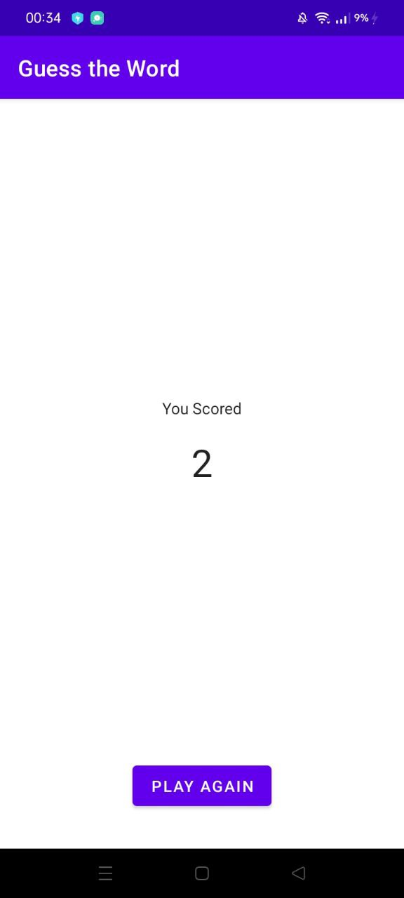
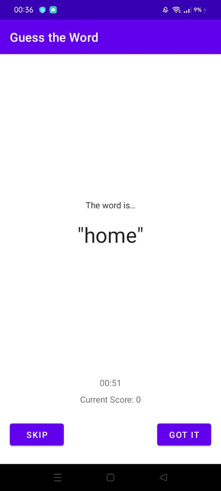

# Guess It!

Guess It is a word guessing app you can play with one or more friends .

It's part of [Android App Development in Kotlin course on Udacity](https://www.udacity.com/course/developing-android-apps-with-kotlin--ud9012).

## Screenshots

  

* MVVM Architecture
* ViewModel
* ViewModelFactory
* Data binding
* LiveData
